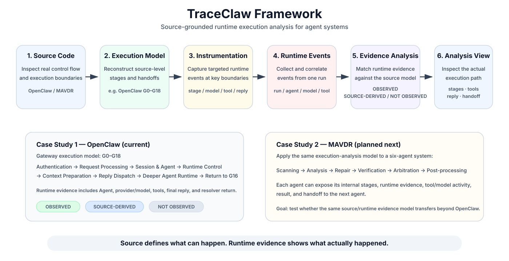
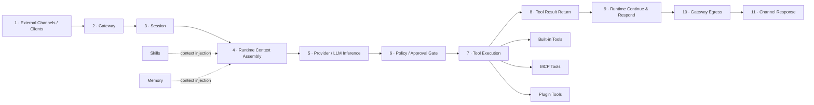
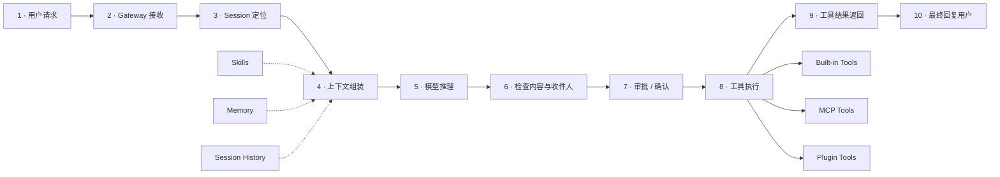

# TraceClaw

TraceClaw is a **source-guided runtime execution analysis system for OpenClaw**. I built it to answer a practical question: when a `chat.send` request runs, how does it actually move through the system, which parts of the source path execute, and where does control enter and leave the deeper Agent Runtime?

The current implementation is pinned to **OpenClaw `v2026.7.1-2`**. It combines a source-level model of the Gateway path (**G0–G18**) with runtime instrumentation for Agent selection, provider/model execution, tool calls, final-reply capture, and the return to Gateway control flow.

The basic rule in the UI is:

> **Source shows the path that can exist. Runtime evidence shows what this run actually exposed.**

## Framework



At a high level, TraceClaw moves through six steps:

**source code → execution model → runtime instrumentation → runtime events → evidence correlation → execution analysis view**

The current OpenClaw implementation is the first case study. The planned MAVDR integration is the next test of whether the same source/runtime evidence model transfers to a multi-agent system.

The proposed cross-system trace abstraction is documented in [`docs/trace-schema.md`](docs/trace-schema.md). It is a design target for generalization rather than a claim that the current OpenClaw collector already emits every event in one fully normalized format.

## OpenClaw workflow context

The following source-informed overview summarizes the broader OpenClaw runtime. It is intentionally rendered natively in GitHub so the labels remain sharp at different screen sizes.



The high-level stages cover:

- **External clients → Gateway:** request intake, authentication/authorization, RPC dispatch, and routing;
- **Session:** session-key resolution, transcript/state loading, and history/compaction support;
- **Runtime context assembly:** system prompt, session history, Skills, Memory, and available tools;
- **Provider / LLM:** model inference, streaming/retry/continuation, and deciding whether a tool is needed;
- **Policy / approval:** allow/deny/approval logic and safety checks around tool use;
- **Tool execution → result:** built-in, MCP, or plugin tools and their returned outputs;
- **Runtime continue → Gateway egress:** continue the agent loop, compose the final response, update state, and deliver the output to the channel.

This overview is useful as **system context**, but TraceClaw does not treat it as runtime ground truth. The stage-level **G0–G18 model is separately re-derived and checked against the pinned `v2026.7.1-2` source snapshot**.

### Example workflow

A concrete validation example makes the same high-level path easier to read: preparing and sending a recruiting link to a Columbia Statistics student.



In this example, the model first interprets the task and prepares a send plan; recipient/content checks and approval happen before the sending tool is executed; the tool result is then returned to the runtime before the final user-facing response is composed.

The original raster workflow references are kept under [`docs/figures/`](docs/figures/) for project history, while the README uses native diagrams for clearer recruiting/review presentation.

### What TraceClaw adds

The workflow diagrams explain the **overall system structure**. TraceClaw adds a lower-level execution-analysis layer on top of that structure:

- source-grounded stage reconstruction for the pinned OpenClaw version;
- direct runtime evidence overlaid on the source model;
- explicit separation of **OBSERVED**, **SOURCE-DERIVED**, and **NOT OBSERVED** states;
- correlation across Gateway, Agent Runtime, model/provider, and tool execution;
- final-reply capture at the winning run-result boundary;
- explicit observation of the resolver return from Agent Runtime back into Gateway control flow.

## Why I built it

At first, I tried to analyze a request mostly from logs and message-level callbacks. That worked for some stages, but it became unreliable around the Agent Runtime boundary because isolated events did not always reveal the full execution path or the true semantic boundaries.

The clearest example was the final assistant reply. An early message-end hook could fire before later tool execution, retry/fallback logic, or winner selection had finished. In other words, an event was observable, but it was not necessarily the semantic end of the run.

That led to the main design of TraceClaw:

- reconstruct the control flow from source;
- instrument a small number of important runtime boundaries;
- keep direct observations separate from source-derived facts;
- correlate Gateway execution with the deeper Agent Runtime.

## What it does

- Builds a version-specific **G0–G18 source model** for the OpenClaw Gateway `chat.send` path.
- Captures Gateway runtime events and post-G18 Agent Runtime events.
- Correlates Session, Agent, resolver, provider/model, tool, final-reply, and return-to-G16 state.
- Shows **direct observations**, **source-derived path facts**, and **unobserved state** separately.
- Replays a run in the browser, with Pause/Resume affecting visualization only.
- Captures the final reply from the **winning run result**, after fallback/winner selection.
- Saves completed traces locally and can publish the latest normalized trace to the repository.
- Includes verification scripts that detect a stale or uninstrumented local OpenClaw build before a trace is trusted.

## Execution path

```text
User prompt
   │
   ▼
OpenClaw Gateway
   │
   ├─ G0–G2   Connection authentication
   ├─ G3–G5   Request validation / normalization
   ├─ G6–G9   Session + Agent resolution
   ├─ G10–G12 Policy / dedupe / work admission
   ├─ G13–G15 Runtime context preparation
   └─ G16–G18 Reply dispatch + resolver boundary
                    │
                    ▼
             Deeper Agent Runtime
                    │
                    ├─ agent_runtime_selected
                    ├─ agent_run_started
                    ├─ tool_started / tool_result
                    ├─ agent_reply_finalized
                    ├─ agent_run_ended
                    └─ reply_resolver_returned
                    │
                    ▼
             G16 resumes processing
                    │
                    ▼
             G14 returns final result
```

The numbered Gateway model stops at **G18** on purpose. Post-G18 events live under a separate `agentRuntime` object instead of being renamed into a synthetic G19.

## How to read the evidence

| Label | Meaning |
| --- | --- |
| **SOURCE MODEL** | Fixed source structure for the pinned OpenClaw version. |
| **OBSERVED** | Direct runtime/native evidence from the current run. |
| **SOURCE-DERIVED** | The current run plus verified source control flow supports the path, but there is no standalone runtime event for it. |
| **NOT OBSERVED** | No direct evidence for that stage, branch, or value in the current run. |

Before a live run starts, the page shows only the **SOURCE MODEL**. It does not reuse runtime values from the previously published trace.

This matters most around **G14–G16**. The current instrumentation does not emit a standalone event for every internal step there, so those stages can be source-confirmed by surrounding runtime evidence without being mislabeled as directly observed.

## Two issues that shaped the design

### 1. Pre-run state could leak stale runtime evidence

An early version of the viewer could preload the most recently published trace and render parts of that historical runtime state before a new live run had started. Old prompt, Session, Agent, or source-derived values could therefore appear in a page that was supposed to represent a fresh run.

The fix was to make the normal live viewer evidence-neutral before execution: it shows only the **SOURCE MODEL** until the new run enters live execution states. Saved traces remain available through an explicit reference view.

This reinforced an important rule for the project: **historical/reference data and current-run evidence must never be conflated.**

### 2. A message-end event was not the final-reply boundary

The final-reply capture exposed a deeper issue. An early message-end hook could fire before later tool execution, retry/fallback logic, or winner selection had finished.

```text
message end
   │
   ├─ tool execution may still happen
   ├─ retry / fallback may still happen
   └─ winning run may not be selected yet

winning run result selected
   │
   ▼
finalAssistantVisibleText / finalAssistantRawText
   │
   ▼
agent_reply_finalized
```

The current instrumentation captures the final reply from the **winning run result**. This avoids treating an observable message event as the semantic end of execution when the runtime still has work left to do.

Together, these two issues pushed TraceClaw toward a stricter separation between **what the source permits, what the current run directly exposes, and what the UI is allowed to claim as evidence**.

## Current status

| Capability | Status |
| --- | --- |
| Arbitrary live prompt execution | Working |
| G0–G18 Gateway visualization | Working |
| Source vs current-run evidence separation | Working |
| Post-G18 Agent Runtime tracing | Working |
| Provider / model capture | Working |
| Tool start / result capture | Working |
| Final Agent reply capture | Working |
| Return-to-G16 resolver boundary | Working |
| Pause / Resume visualization | Working |
| Fresh Session per run | Working |
| Session reuse | Working |
| Saved / published trace view | Working |
| Auto-publish latest successful run | Working |
| Source-level pseudocode + source ranges | Working |
| Runtime alignment / instrumentation doctor | Working |

## Source model

The Gateway stages are grouped as follows:

```text
Connection
G0  Connection Auth State
└─ G1  Shared Credential Authorization
G2  Final Authentication & Handshake

Request path
M1  Request Processing        G3–G5
M2  Session & Agent           G6–G9
M3  Runtime Control           G10–G12
M4  Context Preparation       G13–G15
M5  Reply Dispatch            G16–G18
```

The reply-side relationship is:

```text
G14 dispatchInboundMessage(...)
├─ G15 finalizeInboundContext(...)
└─ G16 dispatchReplyFromConfig(...)
   ├─ G17 downstream Agent re-resolution
   └─ G18 reply resolver invocation
        ↓
        Deeper Agent Runtime
        ↓
        replyResult returns to G16
```

All current source mappings are tied to:

```text
OpenClaw v2026.7.1-2
commit 0790d9f593ad30c940ed93b5872a8cf6d6f3cf8c
```

The stage definitions in `data/stages/` are therefore version-specific mappings, not generic descriptions of every OpenClaw release.

## Live architecture

```text
Browser (127.0.0.1:8765)
        │
        │ POST /api/live/start
        │ GET  /api/live/{liveRunId}
        ▼
Local viewer + collector
        │
        ├─ OpenClaw CLI / Gateway request
        ├─ TraceClaw JSONL reader
        └─ run correlation
                 │
                 ▼
Instrumented OpenClaw Gateway
        │
        ├─ G0–G18 events
        └─ post-G18 Agent Runtime events
                 │
                 ▼
        normalized run snapshot
        ├─ stages
        └─ agentRuntime
                 │
                 ▼
          browser playback
```

Gateway credentials stay local and are not embedded in the frontend.

## Quick start

### Requirements

- OpenClaw installed locally
- OpenClaw Gateway running
- Python 3
- this repository
- TraceClaw runtime instrumentation applied to the pinned OpenClaw checkout

Verify OpenClaw first:

```bash
which openclaw
openclaw gateway status
```

Clone the repository:

```bash
git clone https://github.com/Chi123Zhang/openclaw-gateway-trace.git
cd openclaw-gateway-trace
```

Start the viewer:

```bash
zsh start_live.sh
```

Or point it at another JSONL trace file:

```bash
TRACECLAW_LOG_PATH=/absolute/path/to/gateway-runtime.jsonl zsh start_live.sh
```

Then open:

```text
http://127.0.0.1:8765/
```

`start_live.sh` runs a runtime doctor before starting the viewer. This prevents a normal assistant response from being mistaken for a valid G0–G18 trace when the local Gateway is stale or uninstrumented.

A tool-using prompt is useful for showing the full cross-layer path:

```text
G0–G18
  ↓
Agent Runtime
  ↓
tool_started
  ↓
tool_result
  ↓
agent_reply_finalized
  ↓
reply_resolver_returned
```

## Completed-run publishing

Each successful live run is stored locally and, by default, normalized into the public latest snapshot:

```text
collector/runs/<timestamp>_<runId>.json   local archive (gitignored)
                 ↓
data/cases/latest-live.js                 replaceable published snapshot
                 ↓
git commit + push origin main
```

Only the normalized trace is pushed. Raw local run archives remain ignored.

Disable automatic publication with:

```bash
TRACECLAW_AUTO_PUBLISH_LATEST=0 zsh start_live.sh
```

Explicit `?reference=1` pages are treated as saved/published trace views. The normal live viewer starts from an evidence-neutral **SOURCE MODEL** state.

## Repository layout

```text
openclaw-gateway-trace/
├── index.html                     # main viewer
├── start_live.sh                  # local viewer + collector entry point
├── config.js
├── assets/                        # rendering, evidence, flow, live playback
├── data/
│   ├── modules.js
│   ├── stages/                    # fixed G0–G18 source catalog
│   └── cases/                     # saved / latest published trace
├── collector/                     # live API, parsing, correlation, persistence
├── docs/
│   ├── figures/                   # original workflow references
│   ├── traceclaw-framework.svg    # high-level TraceClaw framework
│   └── trace-schema.md            # proposed cross-system trace abstraction
├── instrumentation/
│   └── openclaw-v2026.7.1-2/     # pinned Gateway + Agent Runtime patches
└── scripts/
    ├── publish_latest_run.py
    ├── reinstall_local_instrumented_gateway.sh
    ├── trace_runtime_doctor.py
    └── verify_agent_runtime_capture.py
```

## Research notes and next step

I am treating the current codebase as a research prototype rather than continuing to add UI features. The next work is mainly evaluation: checking path faithfulness, building fault cases, measuring tracing overhead, and testing how much of the approach transfers across versions or other agent runtimes.

The question I am most interested in is whether **observable message events and semantic execution boundaries diverge often enough to matter in practice**, and whether source-guided runtime execution analysis makes those cases easier to inspect and debug.

As a next step, I plan to adapt the execution-analysis view for the **MAVDR six-agent system at the Chinese Academy of Sciences**, so each agent can be inspected through the same source/runtime evidence model. This will also provide a second case study for testing how well the TraceClaw abstraction generalizes beyond OpenClaw.

## References and early inspiration

### OpenClaw architecture

- [OpenClaw Architecture - Part 1: Control Plane, Sessions, and the Event Loop](https://theagentstack.substack.com/p/openclaw-architecture-part-1-control) — useful early orientation for the Gateway, sessions, and the agent loop.
- [OpenClaw Architecture - Part 6: Reliability, Observability, and Evaluation](https://theagentstack.substack.com/p/openclaw-architecture-part-6-reliability) — especially relevant to observability and runtime evidence.
- [OpenClaw Architecture, Explained: How It Works as an OS for AI Agents](https://ppaolo.substack.com/p/openclaw-system-architecture-overview) — a broad system-level walkthrough of Gateway, Agent Runtime, sessions, tools, and message flow.

### Agent debugging and visual analytics

- [XAgen: An Explainability Tool for Identifying and Correcting Failures in Multi-Agent Workflows](https://arxiv.org/abs/2512.17896) — relevant to failure localization and interactive debugging of agent workflows.
- [Illuminating LLM Coding Agents: Visual Analytics for Deeper Understanding and Enhancement](https://arxiv.org/abs/2508.12555) — useful background for visualizing execution/process structure rather than only final outputs.
- [FlowForge: Guiding the Creation of Multi-agent Workflows with Interactive Visualizations as a Thinking Scaffold](https://ieeevis.org/year/2025/program/paper_ed3195e2-8726-4d85-acb7-c5ed2dc361bb.html) — related visualization work focused on multi-agent workflow design.

### Related runtime observability

- [Fangcun Observer: Runtime Security for AI Agents](https://fangcunleap.com/blog/observer) — a related system focused on framework-independent runtime evidence such as commands, file activity, network access, and behavior chains.

These references helped with orientation and interface ideas. The version-specific stage definitions and source ranges in TraceClaw are based on the pinned OpenClaw source itself.

## Current limitations

1. **G14–G16 do not have standalone runtime events for every internal step.** They may appear as source-confirmed/source-derived when downstream evidence supports the surrounding path.
2. **Post-G18 Agent Runtime evidence requires the pinned local instrumentation patch.** Without it, provider/model/tool/final-reply fields stay explicitly uncaptured.
3. **Connection-level G0–G2 correlation is conservative.** These events happen before request-specific identifiers are consistently available and are not intrinsically one-per-request when a connection is reused.
4. **Live execution requires a local OpenClaw + TraceClaw environment.** A static page can display saved traces but cannot reproduce local runtime execution by itself.
5. **The cross-system trace schema is currently a design target.** MAVDR integration has not yet been completed, so generality beyond OpenClaw remains to be evaluated.

<details>
<summary><strong>Apply / verify the pinned instrumentation</strong></summary>

The version-specific instrumentation lives in:

```text
instrumentation/openclaw-v2026.7.1-2/
```

For the full local macOS setup:

```bash
bash scripts/reinstall_local_instrumented_gateway.sh
```

Verify Agent Runtime capture separately with:

```bash
python3 scripts/verify_agent_runtime_capture.py
```

</details>

<details>
<summary><strong>Live API</strong></summary>

Start a run:

```http
POST /api/live/start
Content-Type: application/json

{
  "message": "What is the weather today?"
}
```

Poll the run:

```http
GET /api/live/{liveRunId}
```

The browser uses the incremental live API; the older blocking `POST /api/run` endpoint remains available for direct testing.

</details>

<details>
<summary><strong>Manual collector startup</strong></summary>

```bash
cd collector
python3 -m venv .venv
source .venv/bin/activate
pip install -r requirements.txt

TRACECLAW_LOG_PATH=/absolute/path/to/gateway-runtime.jsonl \
.venv/bin/python -m uvicorn viewer_server:app \
  --host 127.0.0.1 \
  --port 8765
```

Then open `http://127.0.0.1:8765/`.

</details>